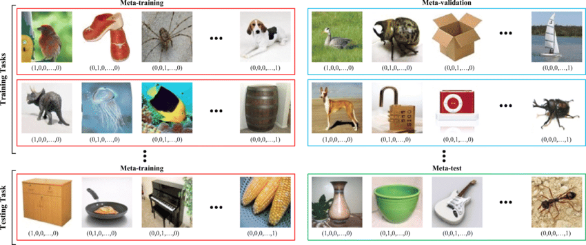

# Few-Shot learning with Prototypes Networks
Simple implementation of prototypical networks in few shot learning

<details>
<summary>Installation</summary>

Create a conda/virtualenv with all necessary packages:

### Conda

`conda create --name fs-learn`

`conda activate fs-learn`

`conda install pytorch torchvision torchaudio -c pytorch`

`conda install --file requirements.txt`

### Venv

`python3 -m pip install virtualenv`

`virtualenv venv-fs-learn`

`source venv/bin/activate`

`python3 -m pip install torch torchvision`

`python3 -m pip install ./requirements.txt`

</details>

<details>
<summary>Datasets</summary>

We used 3 main classification datasets:
- **mini_imagenet**: a collection of 100 real-world objects classes as rgb images.
  - total: 60,000
  - splits: 64 train, 16 val, 20 test (according to Vinyals et al)
  - Used in paper
  - 
- **omniglot**: a collection of 1623 classes of handwritted characters. Each image is then rotated 3 more times by 90 degrees.
  - total: 32460 real, plus 4 rotations per image
  - splits: 1032 train, 172 val, 464 test (according to Vinyals et al)
  - Used in paper
  - 
- **flowers102**: a collection of 102 real-world flowers classes as rgb images.
  - total: 32460 real, plus 4 rotations per image
  - splits: 64 train, 16 val, 22 test (random seed for splits)
  - **NOT** Used in paper
  - 
</details>

<details open>
<summary>Usage</summary>

The starter script is **train.py** that has all necessary params to train and validate on a dataset.

To replicate the results, launch this training:

```bash
python train.py --dataset mini_imagenet \
                --epochs 200 \
                --gpu \
                --train-num-class 30 \
                --test-num-class 5 \
                --number-support 5 \
                --train-num-query 15 \
                --episodes-per-epoch 100 \
                --adam-lr 0.001 \
                --opt-step-size 20 \
                --opt-gamma 0.5 \
                --distance-function "euclidean" \
                --save-each 5
```

Implemented datasets are [omniglot, mini_imagenet, flowers102]:

</details>

<details open>
<summary>Experiments</summary>

### Training datasets info

| Dataset | Images<br><sup>(shape) | Embeddings<br><sup>(shape) | Duration<br><sup>(Colab T4) |
|---------|------------------------|----------------------------|-----------------------------|
| mini_imagenet | (84, 84, 3)            | (batch, 1600)              | gpu / 1h43m                 |
| omniglot | (28, 28, 1)            | (batch, 60)                | gpu / 2h32                  |
| flowers102 | (74, 74, 3)            | (batch, 1024)              | gpu / 58m                   |

### 1-shot vs few-shot

Lots of experiments were done using basic paper's data by replicating the training.
All of these uses **nway=30**, **epochs=200** and **iterations_per_epoch=100** for training.
Then evaluation is performed in different n-ways and k-shots.

| Dataset       | Paper res<br>5-way 5-shot<br><sup>(Acc) | Our res<br>5-way 5-shot<br><sup>(Acc)                                                                                             | Paper res<br>5-way 1-shot<br><sup>(Acc) | Our res<br>5-way 1-shot<br><sup>(Acc)                                                                                             |
|---------------|-----------------------------------------|-----------------------------------------------------------------------------------------------------------------------------------|-----------------------------------------|-----------------------------------------------------------------------------------------------------------------------------------|
| mini_imagenet | 68.20                                   | [63.62](https://github.com/fabian57fabian/fewshot-learning-prototypical-networks/blob/main/results/mini_imagenet/train_5shot.png) | 49.42                                   | [46.13](https://github.com/fabian57fabian/fewshot-learning-prototypical-networks/blob/main/results/mini_imagenet/train_1shot.png) |
| omniglot      | 98.80                                   | [97.77](https://github.com/fabian57fabian/fewshot-learning-prototypical-networks/blob/main/results/omniglot/train_5shot.png)      | 98.8                                    | [91.93](https://github.com/fabian57fabian/fewshot-learning-prototypical-networks/blob/main/results/omniglot/train_1shot.png)      | 
| flowers102    | /                                       | [84.48](https://github.com/fabian57fabian/fewshot-learning-prototypical-networks/blob/main/results/flowers102/train_5shot.png)    | /                                       | [56.08](https://github.com/fabian57fabian/fewshot-learning-prototypical-networks/blob/main/results/flowers102/train_1shot.png)    | 

### Euclidean vs cosine distances

Cosine experiments were done on 5-way 5-shot configurations.
Same results for similar 1-shot and 20-way trainings.

| Dataset | Cosine<br><sup>(acc) | Euclidean<br><sup>(acc) |
|---------|----------------------|-------------------------|
| mini_imagenet | 22.36                | **63.62**               |
| omniglot | 23.48                | **97.77**               |
| flowers102 | 82.89                | **84.48**               |


</details>
